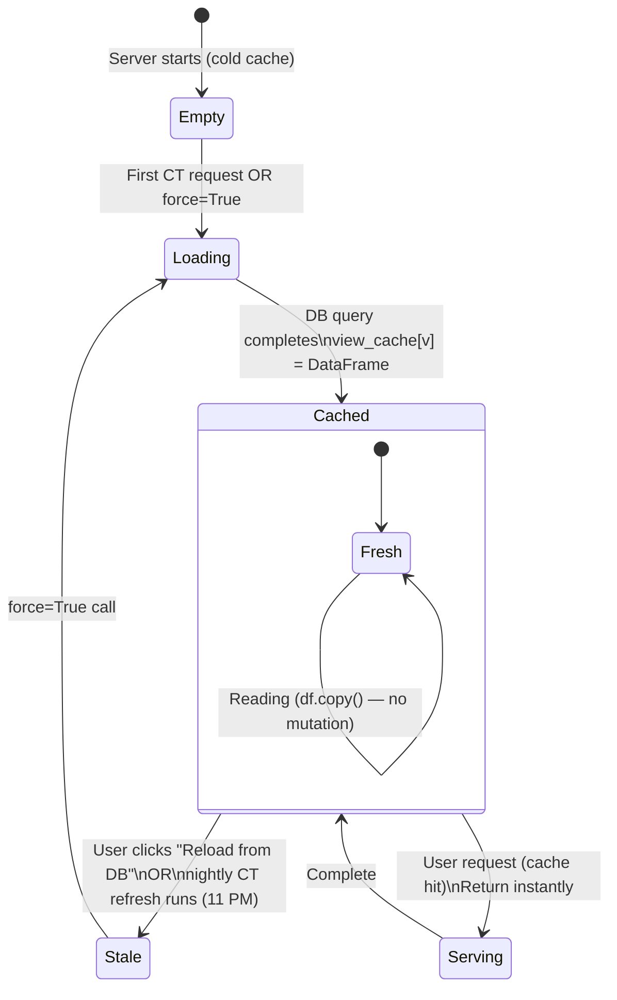

# Diagram: Control Tower Data Flow

## CT View Lifecycle

```
                    ┌─────────────────────────────────────────────┐
                    │         BROWSER (User)                      │
                    │  Opens CT Tab → Selects View v2             │
                    └────────────────────┬────────────────────────┘
                                         │ POST /api/dashboard/create-control-tower-v2
                                         │ {filters: {branch: "Delhi"}}
                                         ▼
                    ┌─────────────────────────────────────────────┐
                    │         FastAPI Route Handler               │
                    │  create_control_tower_v2(req)               │
                    └────────────────────┬────────────────────────┘
                                         │
                                         ▼
                    ┌─────────────────────────────────────────────┐
                    │       _fetch_ct_df("v2", force=False)       │
                    │                                             │
                    │  ┌─────────────────────────────────────┐   │
                    │  │     view_cache["v2"] exists?         │   │
                    │  └──────────────┬──────────────────────┘   │
                    │                 │                           │
                    │          Yes ───┤──── No                    │
                    │                 │     │                     │
                    │  ┌──────────────▼┐    │                     │
                    │  │ CACHE HIT     │    │                     │
                    │  │ Return cached │    ▼                     │
                    │  │ DataFrame     │  Acquire asyncio lock    │
                    │  │ (instant)     │  (prevent duplicate hits)│
                    │  └──────────────┘    │                      │
                    │                      ▼                      │
                    │               Execute _CT_BASE_SQL          │
                    │               against MySQL RDS             │
                    │               (~573K rows, ~2-5 seconds)    │
                    │                      │                      │
                    │                      ▼                      │
                    │               Store in view_cache["v2"]     │
                    │               Release lock                  │
                    └──────────────────────┬──────────────────────┘
                                           │ Raw DataFrame
                                           ▼
                    ┌─────────────────────────────────────────────┐
                    │   _apply_ct_derived_columns(df, "v2")       │
                    │                                             │
                    │  + is_delivered        (lsp_status check)  │
                    │  + is_intransit        (not delivered)      │
                    │  + overdue_days        (today - schdate)    │
                    │  + is_delayed_non_delivered                 │
                    │  + is_todays_edd       (schdate == today)   │
                    │  + is_future_edd       (schdate > today)    │
                    │  + edd_category        (Today/Week/Later)   │
                    └──────────────────────┬──────────────────────┘
                                           │ Enriched DataFrame
                                           ▼
                    ┌─────────────────────────────────────────────┐
                    │   DataSliceService.compute_slice(           │
                    │     df, filters, group_by, metrics          │
                    │   )                                         │
                    │                                             │
                    │  df_copy = df.copy()  ← CRITICAL: copy!    │
                    │  Apply branch filter                        │
                    │  Apply date range filter                    │
                    │  Group by dimension                         │
                    │  Aggregate metrics                          │
                    └──────────────────────┬──────────────────────┘
                                           │ Panel DataFrames
                                           ▼
                    ┌─────────────────────────────────────────────┐
                    │   Build Chart Specs (Recharts JSON)         │
                    │   Construct DashboardConfig                 │
                    └──────────────────────┬──────────────────────┘
                                           │ DashboardConfig JSON
                                           ▼
                    ┌─────────────────────────────────────────────┐
                    │         BROWSER renders panels               │
                    │  Recharts draws charts from JSON specs       │
                    └─────────────────────────────────────────────┘
```

---

## Cache States and Transitions



---

## "Reload from DB" Flow

What happens when a user clicks the Reload button:

```
User clicks "Reload from DB" (v2 tab)
                │
                ▼
POST /api/dashboard/refresh-cache/v2
                │
                ▼
1. _fetch_ct_df("v2", force=True)
   → Hits MySQL directly (bypasses cache)
   → Updates view_cache["v2"] with fresh data
   → Logs row count to activity
                │
                ▼
2. Evict stale active_sessions
   For each active session:
     if session.source_view == "v2":
       del active_sessions[session_id]
   (Forces next panel render to re-read from fresh view_cache)
                │
                ▼
3. Return {status: "refreshed", view: "v2", row_count: 12847}
                │
                ▼
Frontend refreshes the CT panel display
```

**Why session eviction matters:**
Saved dashboards hold a `run_id`. When a panel renders, `_get_result_df(run_id, view)` checks:
1. `active_sessions[run_id]` — stale session (old data) ← this was the bug
2. `view_cache[view]` — fresh data (after cache refresh)
3. SQLite fallback
4. Live DB

Without evicting the stale session, step 1 always wins with old data.

---

## Multi-Session Isolation

Multiple users can have different filtered views of the same CT data simultaneously:

```
view_cache["v2"] = Full DataFrame (573K rows, SHARED, READ-ONLY)
                            │
              ┌─────────────┼────────────────┐
              │             │                │
              ▼             ▼                ▼
    User A (Delhi)    User B (Mumbai)   Maria Q&A
    df.copy()         df.copy()         df.copy()
    filter: Delhi     filter: Mumbai    filter: last_7d
              │             │                │
              ▼             ▼                ▼
    Panel A data      Panel B data      Analyst data
    (independent)     (independent)     (independent)
```

`df.copy()` in `DataSliceService.compute_slice()` ensures:
- Filtering User A's view never affects User B
- Maria's anomaly checks never corrupt CT panel data
- Thread-safe (Pandas copy is fast, GIL-safe for reads)

---

## Nightly CT Refresh Sequence

```
11:00 PM IST — APScheduler triggers _ct_refresh_job()
    │
    ├─ View v1:
    │   ├─ Read maria_config.json → ct_refresh_enabled: true ✓
    │   ├─ _fetch_ct_df("v1", force=True) → MySQL query
    │   ├─ Evict active_sessions for v1 dashboards
    │   └─ activity_store.log("CT Refresh v1: 573420 rows")
    │
    ├─ View v2: (same pattern)
    │   └─ activity_store.log("CT Refresh v2: 12847 rows")
    │
    ├─ View v3: ...
    ├─ View v4: ...
    └─ View v5: ...
        └─ activity_store.log("CT Refresh complete: 5 views refreshed")

Total time: ~30-90 seconds

08:00 AM next morning:
    Morning Brief runs → _fetch_and_summarize("v1") → CACHE HIT ✓
    All 5 views served from fresh overnight cache
```
