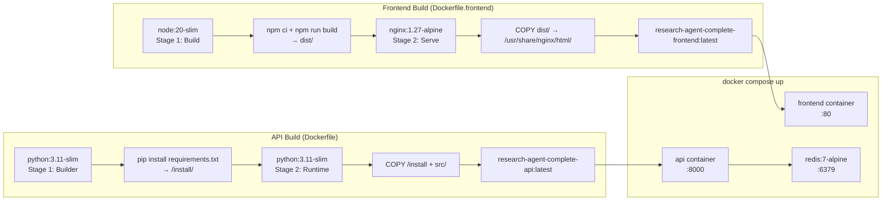

# Diagram: Docker Topology

## Container Topology

```
┌─────────────────────────────────────────────────────────────────────────┐
│  Host: ai-research.cargofl.com (Linux VM)                               │
│                                                                         │
│  ┌─────────────────────────────────────────────────────────────────┐   │
│  │  Docker Network: research-agent-complete_default (bridge)        │   │
│  │                                                                  │   │
│  │  ┌──────────────────────────────────────────────────────────┐   │   │
│  │  │  Container: research-agent-complete-frontend-1            │   │   │
│  │  │  Image: research-agent-complete-frontend                  │   │   │
│  │  │  Base: nginx:1.27-alpine                                  │   │   │
│  │  │                                                           │   │   │
│  │  │  Port mapping: 0.0.0.0:80 → container:80                 │   │   │
│  │  │                                                           │   │   │
│  │  │  Contents:                                                │   │   │
│  │  │  /usr/share/nginx/html/ ← React build (dist/)            │   │   │
│  │  │  /etc/nginx/conf.d/     ← nginx config                   │   │   │
│  │  │                                                           │   │   │
│  │  │  nginx routes:                                            │   │   │
│  │  │  GET /          → serve index.html (SPA)                  │   │   │
│  │  │  GET /assets/*  → serve static assets                     │   │   │
│  │  │  /api/*         → proxy to api:8000                       │   │   │
│  │  └──────────────────────────────────────────────────────────┘   │   │
│  │                                                                  │   │
│  │  ┌──────────────────────────────────────────────────────────┐   │   │
│  │  │  Container: research-agent-complete-api-1                 │   │   │
│  │  │  Image: research-agent-complete-api                       │   │   │
│  │  │  Base: python:3.11-slim                                   │   │   │
│  │  │                                                           │   │   │
│  │  │  Port mapping: 0.0.0.0:8000 → container:8000             │   │   │
│  │  │                                                           │   │   │
│  │  │  Volumes:                                                 │   │   │
│  │  │  ./data → /app/data  (bind mount — persistent)           │   │   │
│  │  │                                                           │   │   │
│  │  │  Environment: loaded from .env                           │   │   │
│  │  │                                                           │   │   │
│  │  │  Process: uvicorn src.api.main_complete:app               │   │   │
│  │  │           --host 0.0.0.0 --port 8000                     │   │   │
│  │  │                                                           │   │   │
│  │  │  /app/                                                    │   │   │
│  │  │  ├── src/          ← Python source                        │   │   │
│  │  │  ├── table.yaml    ← Schema config                        │   │   │
│  │  │  ├── start.sh      ← Entrypoint                           │   │   │
│  │  │  └── data/         ← Mounted volume (see below)           │   │   │
│  │  └──────────────────────────────────────────────────────────┘   │   │
│  │                                                                  │   │
│  │  ┌──────────────────────────────────────────────────────────┐   │   │
│  │  │  Container: research-agent-complete-redis-1               │   │   │
│  │  │  Image: redis:7-alpine                                    │   │   │
│  │  │                                                           │   │   │
│  │  │  Port: 6379 (internal only — not exposed to host)        │   │   │
│  │  │                                                           │   │   │
│  │  │  Accessed by api container as: redis:6379                │   │   │
│  │  └──────────────────────────────────────────────────────────┘   │   │
│  └─────────────────────────────────────────────────────────────────┘   │
│                                                                         │
│  Host Volume (bind mount):                                              │
│  ./data/                                                                │
│  ├── dashboards/    ← Saved dashboard configs (JSON)                    │
│  ├── uploads/       ← User-uploaded Excel files                         │
│  ├── outputs/       ← Generated reports and exports                     │
│  ├── chroma_db/     ← Chroma vector store                               │
│  ├── maria_config.json                                                  │
│  ├── maria_subscriptions.json                                           │
│  ├── maria_allowed_senders.json                                         │
│  ├── maria_activity.json                                                │
│  └── run_history.json                                                   │
└─────────────────────────────────────────────────────────────────────────┘
```

---

## Network Traffic Flow

```
INBOUND:

Internet → Port 80 → nginx (frontend container)
  │
  ├── GET / → React SPA (index.html + JS bundle)
  ├── GET /assets/* → Static files
  └── /api/* → Proxy to api:8000 (internal Docker network)

Internet → Port 8000 → uvicorn (api container)  [direct, for dev/debug]


OUTBOUND (from api container):

api:8000 → cargofl-puma-sync.c52ewqoqkh1q.ap-south-1.rds.amazonaws.com:3306
  MySQL queries (CT views, analysis queries)

api:8000 → api.openai.com:443
  GPT-4o API calls (planning, summarization, Q&A narration)

api:8000 → smtp.gmail.com:587
  Outbound email (morning briefs, digests, alerts, Q&A replies)

api:8000 → imap.gmail.com:993
  IMAP polling (incoming Q&A questions, every 5 minutes)
```

---

## Build Pipeline



---

## Deployment Commands Reference

```bash
# Full build + start
docker compose up -d --build

# Rebuild API only (Python code change)
docker compose up -d --build api

# Rebuild frontend only (React code change)
docker compose up -d --build frontend

# Stop everything
docker compose down

# Stop + delete volumes (WARNING: destroys data/)
docker compose down -v

# Check running containers
docker compose ps

# Follow logs
docker compose logs -f

# Check specific container
docker logs research-agent-complete-api-1 --tail=100 -f

# Exec into API container (debug)
docker exec -it research-agent-complete-api-1 bash

# Check container resource usage
docker stats
```
