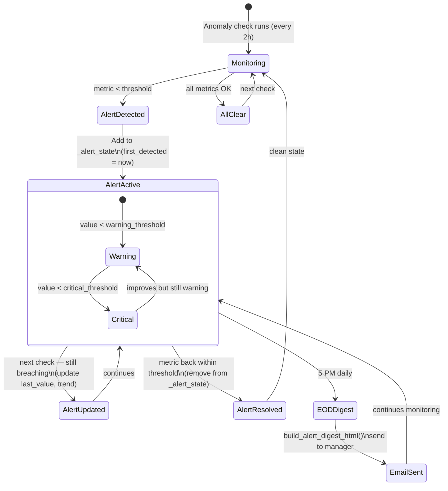
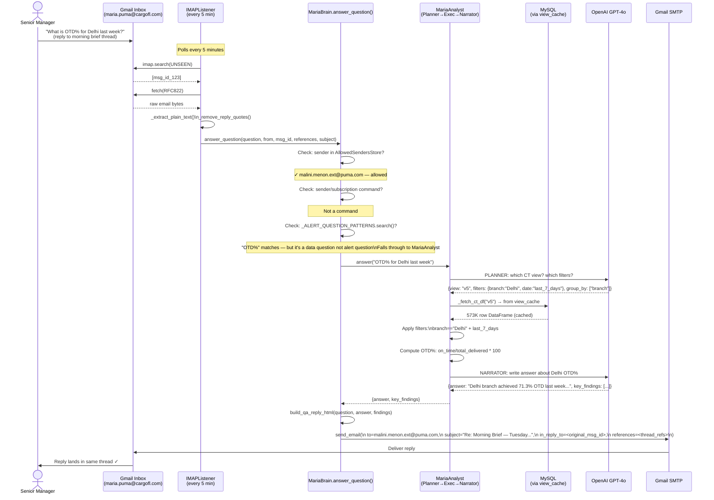

# Diagram: Maria Agent Workflow

## Maria's Daily Operational Timeline

```
00:00 ─────────────────────────────────────────────────────────────── 24:00
  │                                                                      │
  │  23:00 ──── CT Data Refresh ────┐                                   │
  │             All 5 CT views      │                                   │
  │             refreshed from DB   │                                   │
  │                                 │                                   │
  │  00:00 (midnight) ──────────────┘                                   │
  │                                                                      │
  │  ┌── 08:00 ── Morning Brief ──────────────────────────────────────┐ │
  │  │   Fetch all CT views (from view_cache or DB)                   │ │
  │  │   Compute KPI snapshot (OTD%, overdue count)                   │ │
  │  │   Build HTML email with charts + findings                       │ │
  │  │   Send to: SENIOR_MANAGER_EMAIL + CC list                      │ │
  │  └───────────────────────────────────────────────────────────────┘ │
  │                                                                      │
  │  ┌── Every 2 hours ── Anomaly Check ─────────────────────────────┐ │
  │  │   Fetch v5 (OTD) + v2 (overdue/delay) DataFrames              │ │
  │  │   Compute: OTD%, avg delay hours, overdue count               │ │
  │  │   Compare against thresholds                                   │ │
  │  │   Update _alert_state (no email — digest handles that)         │ │
  │  └───────────────────────────────────────────────────────────────┘ │
  │                                                                      │
  │  ┌── Every 5 minutes ── IMAP Poll ────────────────────────────────┐ │
  │  │   Connect to imap.gmail.com:993                                │ │
  │  │   Fetch UNSEEN messages                                        │ │
  │  │   Filter to allowed senders only                               │ │
  │  │   Parse + strip quoted replies                                  │ │
  │  │   Route to answer_question()                                   │ │
  │  └───────────────────────────────────────────────────────────────┘ │
  │                                                                      │
  │  ┌── 17:00 ── EOD Alert Digest ───────────────────────────────────┐ │
  │  │   Read _alert_state                                            │ │
  │  │   If empty → "All Clear" email                                 │ │
  │  │   If alerts → format with value/threshold/duration/trend       │ │
  │  │   Send to: SENIOR_MANAGER_EMAIL + CC list                      │ │
  │  └───────────────────────────────────────────────────────────────┘ │
  │                                                                      │
  │  ┌── Monday 07:00 ── Weekly Digest ───────────────────────────────┐ │
  │  │   Full week performance summary                                │ │
  │  │   Week-over-week OTD trend                                     │ │
  │  │   Top/bottom transporters                                      │ │
  │  │   Branch performance ranking                                   │ │
  │  └───────────────────────────────────────────────────────────────┘ │
```

---

## Alert Lifecycle



---

## Q&A Email Flow



---

## Alert State Q&A Intercept

When manager replies to a morning brief asking about the alerts mentioned in it:

```
Manager: "In your daily report you mentioned critical and warning alerts, what are they?"
                                         │
                                         ▼
                    answer_question() — Check patterns:
                    ┌─────────────────────────────────────────────────┐
                    │  _ALERT_QUESTION_PATTERNS.search(question)      │
                    │                                                 │
                    │  Matches: "daily report", "mentioned", "alert"  │
                    │                                                 │
                    │  → SHORT CIRCUIT — no DB query, no LLM call    │
                    └─────────────────────────────────────────────────┘
                                         │
                                         ▼
                    _answer_from_alert_state()
                    Reads MariaBrain._alert_state:
                    {
                      "OTD_WARNING": {last_value: 52.7, threshold: 65.0, tier: "warning"},
                      "DELAY_ALERT": {last_value: 115h, threshold: 72h, tier: "warning"}
                    }

                    Formats reply:
                    "Here is the current status of 2 active alerts as of 21 Apr 2026:

                    WARNING — On-Time Delivery (OTD)
                    - Current value: 52.7% (previously 55.1%) ▲
                    - Breach threshold: 65.0%
                    - Active for: 14h
                    - Details: OTD dropped to 52.7%

                    WARNING — Average Shipment Delay
                    - Current value: 115.0 hrs → stable
                    - Breach threshold: 72.0 hrs
                    - Active for: 6h"
                                         │
                                         ▼
                    send_email() — in-thread reply
                    (In-Reply-To + References headers preserved)
```

---

## Error Escalation Flow

```
Any exception in Maria pipeline
         │
         ▼
_notify_if_critical(exc, source, tb_str)
         │
         ├─ _classify_error(exc)
         │   ├─ "quota" / "rate limit" in str(exc) → OPENAI_QUOTA_EXCEEDED
         │   ├─ "auth" / "invalid api key" → OPENAI_AUTH_FAILED
         │   ├─ "can't connect" / "mysql" → DB_CONNECTION_FAILED
         │   └─ Other → should_alert=False
         │
         ├─ should_alert? No → log and return
         │
         ├─ _SystemAlertStore.should_alert(error_type)?
         │   No (cooldown active) → log and return
         │
         └─ send_system_alert(exc, source, tb_str)
             Subject: "URGENT | Maria | OPENAI_QUOTA_EXCEEDED — morning_brief"
             To: support@innoctive.com
             CC: mubin@innoctive.com, deepesh@innoctive.com
             Body: error_type + action_hint + traceback
```
