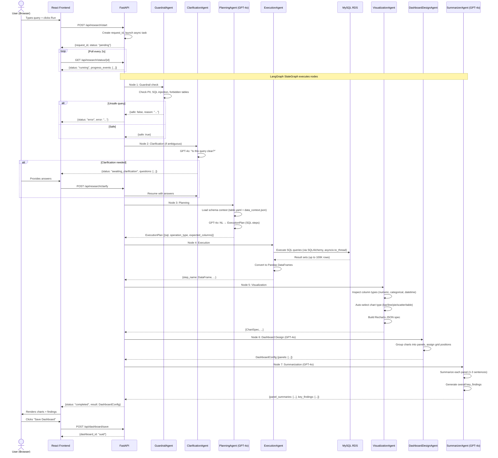

# Diagram: Query Workflow (LangGraph Pipeline)

## End-to-End Query Flow



---

## LangGraph State Machine

```
                    ┌─────────┐
                    │  START  │
                    └────┬────┘
                         │
                         ▼
               ┌─────────────────┐
               │   GUARDRAIL     │
               │ Safety check     │
               └────────┬────────┘
                        │
              ┌─────────┴──────────┐
              │ safe?              │
         No ──┤                    ├── Yes
              │                    │
              ▼                    ▼
           ┌─────┐        ┌────────────────┐
           │ERROR│        │  CLARIFICATION │
           └─────┘        │ (conditional)   │
                          └────────┬───────┘
                                   │
                      ┌────────────┴────────────┐
                      │ needs clarification?      │
                 Yes ─┤                           ├─ No / answered
                      │                           │
                      ▼                           ▼
              ┌──────────────┐         ┌──────────────────┐
              │ WAIT FOR     │         │    PLANNING       │
              │ USER INPUT   │         │  NL → SQL plan    │
              └──────┬───────┘         └────────┬─────────┘
                     │                          │
                     │ (answers provided)        ▼
                     └─────────────────▶ ┌──────────────────┐
                                         │    EXECUTION      │
                                         │  SQL → DataFrames │
                                         └────────┬─────────┘
                                                  │
                                         ┌────────┴─────────┐
                                         │ SQL error?        │
                                    Yes ─┤                    ├─ No
                                         │                    │
                                         ▼                    ▼
                                    ┌────────┐     ┌──────────────────┐
                                    │ RETRY  │     │  VISUALIZATION   │
                                    │ (once) │     │  Chart specs      │
                                    └────────┘     └────────┬─────────┘
                                                            │
                                                   ┌────────▼─────────┐
                                                   │  DASHBOARD DESIGN │
                                                   │  Panel layout     │
                                                   └────────┬─────────┘
                                                            │
                                                   ┌────────▼─────────┐
                                                   │  SUMMARIZATION    │
                                                   │  AI findings       │
                                                   └────────┬─────────┘
                                                            │
                                                   ┌────────▼─────────┐
                                                   │  REPORT GEN       │
                                                   │  HTML report       │
                                                   └────────┬─────────┘
                                                            │
                                                   ┌────────▼─────────┐
                                                   │     COMPLETE      │
                                                   └──────────────────┘
```

---

## Data Transformation at Each Step

```
User Query (string)
    │
    ▼ [Planning Agent + GPT-4o]
ExecutionPlan:
  steps = [
    {name: "transporter_otd", sql: "SELECT ...", expected_cols: [...]},
    {name: "branch_breakdown", sql: "SELECT ...", expected_cols: [...]}
  ]
    │
    ▼ [Execution Agent + MySQL]
Results:
  {
    "transporter_otd": pd.DataFrame(143 rows × 4 cols),
    "branch_breakdown": pd.DataFrame(12 rows × 3 cols)
  }
    │
    ▼ [Visualization Agent]
ChartSpecs:
  [
    {chart_type: "bar", data_key: "truckername", metrics: [{key: "otd_pct"}], data: [...]},
    {chart_type: "pie", data_key: "branch", metrics: [{key: "count"}], data: [...]}
  ]
    │
    ▼ [Dashboard Design Agent + GPT-4o]
DashboardConfig:
  panels: [
    {id: "p1", title: "Transporter OTD Performance", chart_spec: {...}, position: {x:0,y:0,w:8,h:4}},
    {id: "p2", title: "Branch Distribution", chart_spec: {...}, position: {x:8,y:0,w:4,h:4}}
  ]
    │
    ▼ [Summarizer Agent + GPT-4o]
Final Output:
  {
    dashboard_config: DashboardConfig,
    panel_summaries: [{panel_id: "p1", summary: "DHL leads with 89% OTD..."}],
    key_findings: ["DHL leads at 89%", "Chennai branch underperforming at 61%"],
    summary: "Overall OTD of 73.4% with DHL as top performer..."
  }
```
