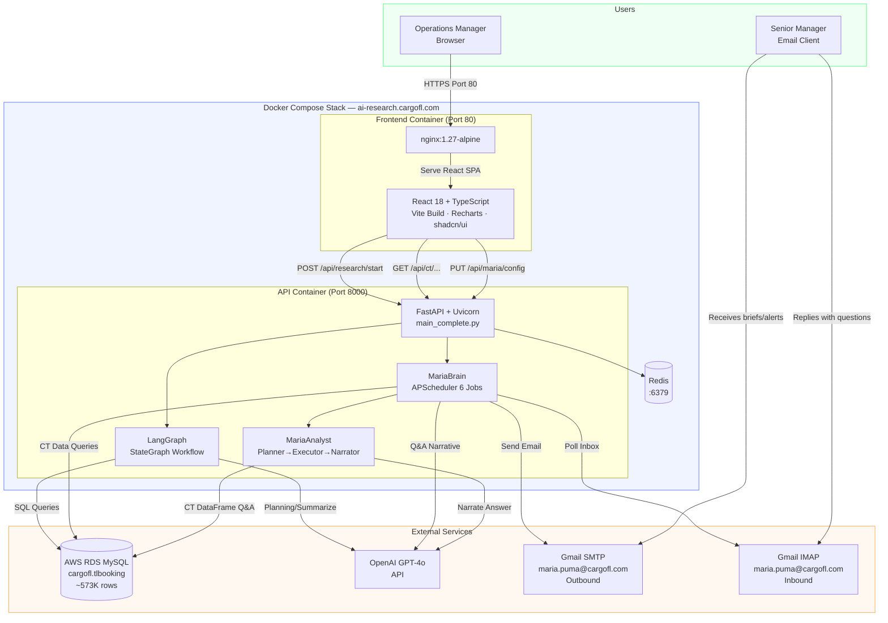

# Diagram: System Architecture

## Full System Overview (Mermaid)



---

## Simplified Component Interaction

```
┌──────────────────────────────────────────────────────────────────────────┐
│  BROWSER (Operations Manager)                                            │
│  4 Tabs: Analysis | Control Tower | Activity | Configure                 │
└──────────────────┬───────────────────────────────────────────────────────┘
                   │ HTTP (port 80 → nginx → port 8000 → FastAPI)
                   ▼
┌──────────────────────────────────────────────────────────────────────────┐
│  FASTAPI  (main_complete.py — 6500+ lines)                               │
│                                                                          │
│  ┌─────────────────┐  ┌──────────────────┐  ┌────────────────────────┐  │
│  │  Research        │  │  Control Tower    │  │  Maria                  │  │
│  │  /api/research/* │  │  /api/ct/*        │  │  /api/maria/*           │  │
│  │  /api/dashboard/*│  │  view_cache       │  │  APScheduler            │  │
│  │                  │  │  5 CT views       │  │  6 scheduled jobs       │  │
│  │  LangGraph       │  │  Derived columns  │  │  MariaBrain             │  │
│  │  8-node workflow │  │                   │  │  IMAPListener           │  │
│  └────────┬─────────┘  └────────┬──────────┘  └───────────┬────────────┘  │
│           │                     │                          │              │
└───────────┼─────────────────────┼──────────────────────────┼──────────────┘
            │                     │                          │
     ┌──────▼──────┐        ┌─────▼──────┐         ┌────────▼────────┐
     │  OpenAI      │        │  MySQL RDS  │         │  Gmail          │
     │  GPT-4o      │        │  tlbooking  │         │  SMTP + IMAP    │
     └─────────────┘        └─────────────┘         └─────────────────┘
```

---

## Container Networking

```
Internet
   │
   │ :80
   ▼
┌──────────────────────────────────────────────────────────┐
│  Docker Network: research-agent-complete_default         │
│                                                          │
│  ┌──────────────┐        ┌────────────────┐             │
│  │  frontend    │        │  api           │             │
│  │  :80 (nginx) │───────▶│  :8000 (uvicorn)│            │
│  └──────────────┘        └───────┬────────┘             │
│                                  │                       │
│                          ┌───────▼────────┐              │
│                          │  redis         │              │
│                          │  :6379         │              │
│                          └────────────────┘              │
└──────────────────────────────────────────────────────────┘
   │
   │ EXTERNAL (outbound from api container)
   ├── RDS MySQL: cargofl-puma-sync.c52ewqoqkh1q.ap-south-1.rds.amazonaws.com:3306
   ├── OpenAI API: api.openai.com:443
   └── Gmail: smtp.gmail.com:587 / imap.gmail.com:993
```
